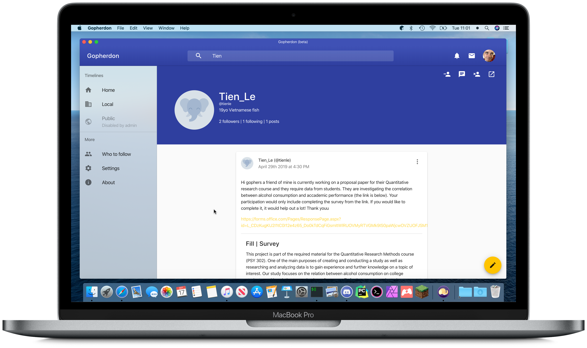

A beautiful client for the Gopherdon network, built from Hyperspace



The Gopherdon apps are the official means of accessing the Gopherdon network at Goucher College. Built from [Hyperspace](https://github.com/hyperspacedev/hyperspace), it aims to provide a beautiful and easy-to-use interface for any Mastodon instance, including Gopherdon.

Changes that overall benefit Hyperspace will be made upstream, and Gopherdon will be in-sync with upstream changes from Hyperspace.

## Build from source

To build Gopherdon Desktop, you'll need the following tools and packages:

-   Node.js v10 or later
-   (macOS-only) Xcode 10 or higher

### Installing dependencies

First, clone the repository from GitHub:

```bash
git clone https://github.com/gopherdonapp/app
```

Then, in the app directory, run the following command to install all of the package dependencies:

```
npm install
```

### Pulling changes from upstream (hyperspacedev/hyperspace)

It is recommended that you make these changes to both the `upstream` and `master` branches, accordingly.

Run the following commands to copy the latest Hyperspace code to Gopherdon in `upstream`:

```bash
git fetch upstream
git checkout upstream
git merge upstream/master
```

If any conflicts arise, check the files and review the changes before fully merging. After merging, make a pull request to the `master` branch to apply the upstream changes.

> Note: Do **not** delete the upstream branch. This is necesary to get changes from Hyperspace and to submit new changes to Hyperspace itself.

### Testing changes

Run any of the following scripts to test:

-   `npm start` - Starts a local server hosted at https://localhost:3000.
-   `npm run electron:build` - Builds a copy of the source code and then runs the app through Electron. Ensure that the `location` key in `config.json` points to `"desktop"` before running this.
-   `npm run electron:prebuilt` - Similar to `electron:build` but doesn't build the project before running.

The `location` key in `config.json` can take the following values during testing:

To run a development version of Gopherdon, either run the `start` task from VS Code or run the following in the terminal:

> Note: Gopherdon Desktop v1.1.0-beta3 and older versions require the location field to be changed to `"https://localhost:3000"` before running.

### Building a release

To build a release, run the following command:

```
npm run build
```

The built files will be available under `build` as static files. These files should get hosted to a web server.

If you are aiming to make an update to the official Gopherdon site, just push your changes to either the `master` (unstable) or `release` (stable) branches.

#### Building desktop apps

You can run any of the following commands to build a release for the desktop:

-   `npm run build:desktop-all`: Builds the desktop apps for all platforms (eg. Windows, macOS, Linux). Will run `npm run build` before building.
-   `npm run build:win`: Builds the desktop app for Windows without running `npm run build`.
-   `npm run build:mac`: Builds the desktop apps for macOS without running `npm run build`. See the details below for more information on building for macOS.
-   `npm run build:mas`: Builds the desktop apps for the Mac App Store without running `npm run build`. See the details below for more information on building for macOS.
-   `npm run build:linux`: Builds the desktop apps for Linux (eg. Debian package, AppImage, and Snap) without running `npm run build`.
-   `npm run build:linux-select-targets`: Builds the desktop app for Linux without running `npm run build`. _Targets are required as parameters._

The built files will be available under `dist` that can be uploaded to your app distributor or website.

#### Extra steps for macOS

The macOS builds of Gopherdon Desktop require a bit more effort and resources to build and distribute accordingly. The following is a quick guide to building Hyperspace Desktop for macOS and for the Mac App Store.

##### Gather your tools

To create a code-signed and notarized version of Gopherdon Desktop, you'll need to acquire some provisioning profiles and certificates from a valid Apple Developer account.

For certificates, make sure your Mac has the following certificates installed:

-   3rd Party Mac Developer Application
-   3rd Party Mac Developer Installer
-   Developer ID Application
-   Developer ID Installer
-   Mac Developer

The easiest way to handle this is by opening Xcode and going to **Preferences &rsaquo; Accounts** and create the certificates from "Manage Certificates".

You'll also need to [create a provisioning profile for **Mac App Store** distribution](https://developer.apple.com/account/resources/profiles/add) and save it to the `desktop` folder as `embedded.provisonprofile`.

##### Create your entitlements files

You'll also need to create the entitlements files in the `desktop` directory that declares the permissions for Hyperspace Desktop. Replace `TEAM_ID` with the appropriate Apple Developer information and `BUNDLE_ID` with the bundle ID of your app.

###### entitlements.mac.plist

```plist
<?xml version="1.0" encoding="UTF-8"?>
<!DOCTYPE plist PUBLIC "-//Apple//DTD PLIST 1.0//EN" "http://www.apple.com/DTDs/PropertyList-1.0.dtd">
<plist version="1.0">
  <dict>
    <key>com.apple.security.cs.allow-unsigned-executable-memory</key>
    <true/>
    <key>com.apple.security.network.client</key>
    <true/>
    <key>com.apple.security.files.user-selected.read-write</key>
    <true/>
  </dict>
</plist>
```

###### entitlements.mas.plist

```plist
<?xml version="1.0" encoding="UTF-8"?>
<!DOCTYPE plist PUBLIC "-//Apple//DTD PLIST 1.0//EN" "http://www.apple.com/DTDs/PropertyList-1.0.dtd">
<plist version="1.0">
<dict>
	<key>com.apple.security.cs.allow-jit</key>
	<true/>
	<key>com.apple.security.network.client</key>
	<true/>
	<key>com.apple.security.app-sandbox</key>
	<true/>
	<key>com.apple.security.cs.allow-unsigned-executable-memory</key>
	<true/>
	<key>com.apple.security.application-groups</key>
	<array>
		<string>TEAM_ID.BUNDLE_ID</string>
	</array>
	<key>com.apple.security.files.user-selected.read-only</key>
	<true/>
	<key>com.apple.security.files.user-selected.read-write</key>
	<true/>
</dict>
</plist>
```

###### entitlements.mas.inherit.plist

```plist
<?xml version="1.0" encoding="UTF-8"?>
<!DOCTYPE plist PUBLIC "-//Apple//DTD PLIST 1.0//EN" "http://www.apple.com/DTDs/PropertyList-1.0.dtd">
<plist version="1.0">
	<dict>
	<key>com.apple.security.app-sandbox</key>
	<true/>
	<key>com.apple.security.inherit</key>
	<true/>
	<key>com.apple.security.cs.allow-jit</key>
	<true/>
	<key>com.apple.security.cs.allow-unsigned-executable-memory</key>
	<true/>
	</dict>
</plist>
```

###### entitlements.mas.loginhelper.plist

```plist
<?xml version="1.0" encoding="UTF-8"?>
<!DOCTYPE plist PUBLIC "-//Apple//DTD PLIST 1.0//EN" "http://www.apple.com/DTDs/PropertyList-1.0.dtd">
<plist version="1.0">
  <dict>
    <key>com.apple.security.app-sandbox</key>
    <true/>
  </dict>
</plist>
```

###### info.plist

```plist
<?xml version="1.0" encoding="UTF-8"?>
<!DOCTYPE plist PUBLIC "-//Apple//DTD PLIST 1.0//EN" "http://www.apple.com/DTDs/PropertyList-1.0.dtd">
<plist version="1.0">
<dict>
	<key>ElectronTeamID</key>
	<string>TEAM_ID</string>
	<key>com.apple.developer.team-identifier</key>
	<string>TEAM_ID</string>
	<key>com.apple.application-identifier</key>
	<string>TEAM_ID.BUNDLE_ID</string>
</dict>
</plist>
```

##### Edit `notarize.js`

You'll also need to edit `notarize.js` in the `desktop` directory. Replace `<TEAM_ID>`, `<BUNDLE_ID>`, and `<APPLE_DEVELOPER_EMAIL>` with the appropriate information from the app and your account from Apple Developer.

```js
// notarize.js
// Script to notarize Hyperspace for macOS
// © 2019 Hyperspace developers. Licensed under Apache 2.0.

const { notarize } = require("electron-notarize");

// This is pulled from the Apple Keychain. To set this up,
// follow the instructions provided here:
// https://github.com/electron/electron-notarize#safety-when-using-appleidpassword
const password = `@keychain:AC_PASSWORD`;

exports.default = async function notarizing(context) {
    const { electronPlatformName, appOutDir } = context;
    if (electronPlatformName !== "darwin") {
        return;
    }

    console.log("Notarizing Hyperspace...");

    const appName = context.packager.appInfo.productFilename;

    return await notarize({
        appBundleId: "<BUNDLE_ID>",
        appPath: `${appOutDir}/${appName}.app`,
        appleId: "<APPLE_DEVELOPER_EMAIL>",
        appleIdPassword: password,
        ascProvider: "<TEAM_ID>"
    });
};
```

Note that the password is pulled from your keychain. You'll need to create an app password and store it in your keychain as `AC_PASSWORD`.

##### Build the apps

Run any of the following commands to build Hyperspace Desktop for the Mac:

-   `npm run build:mac` - Builds the macOS app in a DMG container.
-   `npm run build:mac-unsigned` - Similar to `build:mac`, but skips code signing and notarization. **Use only for CI or in situations where code signing and notarization is not available.**
-   `npm run build:mas` - Builds the Mac App Store package.

## Licensing and Credits

Gopherdon is licensed under the [Non-violent Public License](LICENSE), a permissive license under the conditions that you do not use this for any unethical purposes and to file patent claims. Please read what your rights are as a Gopherdon user/developer in the license for more information.

Gopherdon has been made possible by the React, TypeScript, Megalodon, and Material-UI projects and our contributors on GitHub.

The Gopher icon used for Gopherdon is registered property of Goucher College.

## Contributing

Gopherdon is currently adopting the [contribution guidelines](.github/contributing.md) and [Code of Conduct](.github/code_of_conduct.md) from the main Hyperspace project.
