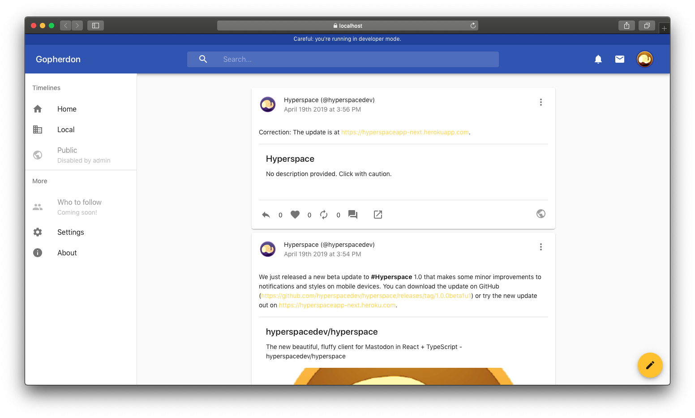

# Gopherdon App

A beautiful client for the Gopherdon network, built from Hyperspace



The Gopherdon apps are the official means of accessing the Gopherdon network at Goucher College. Built from [Hyperspace](https://github.com/hyperspacedev/hyperspace), it aims to provide a beautiful and easy-to-use interface for any Mastodon instance, including Gopherdon.

Changes that overall benefit Hyperspace will be made upstream, and Gopherdon will be in-sync with upstream changes from Hyperspace.

## Build instrictions

### Prerequisites

To develop Gopherdon, you'll need the following tools and packages:

* Node.js 6 or later
* (Optional) Visual Studio Code

### Installing dependencies

First, clone the repository from GitHub:

```bash
git clone https://github.com/gopherdonapp/app
```

Then, in the app directory, run the following command to install all of the package dependencies:

```npm
npm install
```

### Testing changes

To run a development version of Gopherdon, either run the `start` task from VS Code or run the following in the terminal:

```npm
npm start
```

The site will be hosted at https://localhost:3000, where you can sign in and test Gopherdon.

### Building a release

To build a release, run the following command:

```npm
npm build
```

The built files will be available under `build` as static files. These files should get hosted to a web server.

If you are aiming to make an update to the official Gopherdon site, just push your changes to either the `master` (unstable) or `release` (stable) branches.

## Contributing

Gopherdon is currently adopting the [contribution guidelines](.github/contributing.md) and [Code of Conduct](.github/code_of_conduct.md) from the main Hyperspace project.