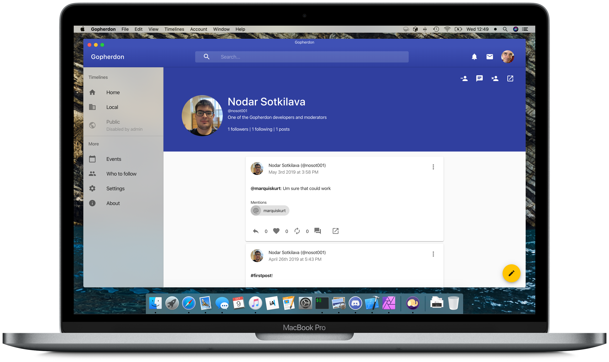

# Gopherdon App

A beautiful client for the Gopherdon network, built from Hyperspace



The Gopherdon apps are the official means of accessing the Gopherdon network at Goucher College. Built from [Hyperspace](https://github.com/hyperspacedev/hyperspace), it aims to provide a beautiful and easy-to-use interface for any Mastodon instance, including Gopherdon.

Changes that overall benefit Hyperspace will be made upstream, and Gopherdon will be in-sync with upstream changes from Hyperspace.

## Build instrictions

### Prerequisites

To develop Gopherdon, you'll need the following tools and packages:

* Node.js 8 or later
* (Optional) Visual Studio Code

### Installing dependencies

First, clone the repository from GitHub:

```bash
git clone https://github.com/gopherdonapp/app
```

Then, in the app directory, run the following command to install all of the package dependencies:

```npm
npm install
```

### Pulling changes from upstream (hyperspacedev/hyperspace)

It is recommended that you make these changes to both the `upstream` and `master` branches, accordingly.

Run the following commands to copy the latest Hyperspace code to Gopherdon in `upstream`:

```bash
git fetch upstream
git checkout upstream
git merge upstream/master
```

If any conflicts arise, check the files and review the changes before fully merging. After merging, make a pull request to the `master` branch to apply the upstream changes.

> Note: Do **not** delete the upstream branch. This is necesary to get changes from Hyperspace and to submit new changes to Hyperspace itself.

### Testing changes

Before testing Gopherdon, make the following change in `config.json`:

```json
    "location": "https://localhost:3000"
```

This is necessary to test Gopherdon locally and will need to be reverted after testing or before releasing to `master`/`release`.

To run a development version of Gopherdon, either run the `start` task from VS Code or run the following in the terminal:

```npm
npm start
```

The site will be hosted at `https://localhost:3000`, where you can sign in and test Gopherdon.

Alternatively, if you are testing the desktop version of Gopherdon, run `npm run electrify` (or `npm run electrify`, if you don't want to make another production build). Gopherdon will open in a window where you can sign in and test Gopherdon with your Mastodon account. You'll be logged in automatically if you've signed in before.

### Building a release

To build a release, run the following command:

```npm
npm build
```

The built files will be available under `build` as static files. These files should get hosted to a web server.

If you are aiming to make an update to the official Gopherdon site, just push your changes to either the `master` (unstable) or `release` (stable) branches.

#### Building desktop releases

You can run any of the following commands to build a release for the desktop:

- `build-desktop`: Builds the desktop apps for all platforms (eg. Windows, macOS, Linux). Will run `npm run build` before building.
- `build-desktop-win`: Builds the desktop app for Windows without running `npm run build`.
- `build-desktop-darwin`: Builds the desktop apps for macOS (eg. disk image, Mac App Store) without running `npm run build`.
- `build-desktop-linux`: Builds the desktop apps for Linux (eg. Debian package, AppImage, and Snap) without running `npm run build`.
- `build-desktop-linux-select`: Builds the desktop app for Linux without running `npm run build`. _Target is required as a parameter._

> Note: If you are building the macOS version of Gopherdon, add your provisioning profiles and entitlements files in the `desktop` folder and ensure you have installed your developer certificates on your machine before running `build-desktop` or `build-desktop-darwin`.
>
> While the command will run without needing the signature, it is recommended that you make a signed copy to protect users.
>

> ⚠️ **Notarization**: If you are building the macOS version of Hyperspace, you will also need to set up notarization processes. Hyperspace will _not_ run on devices running macOS Catalina or later without this notarization; please ensure you have the correct certificates and updated notarization scripts in `desktop/notarize.js`.
> 
> When building, the script will aotumatically notarize the app for you after signing it.

The built files will be available under `dist` that can be uploaded to your app distributor or website.

## Contribute

Contrubition guidelines are available in the [contributing file](.github/contributing.md) and when you make an issue/pull request. Additionally, you can access our [Code of Conduct](.github/code_of_conduct.md).

## Contributing

Gopherdon is currently adopting the [contribution guidelines](.github/contributing.md) and [Code of Conduct](.github/code_of_conduct.md) from the main Hyperspace project.
