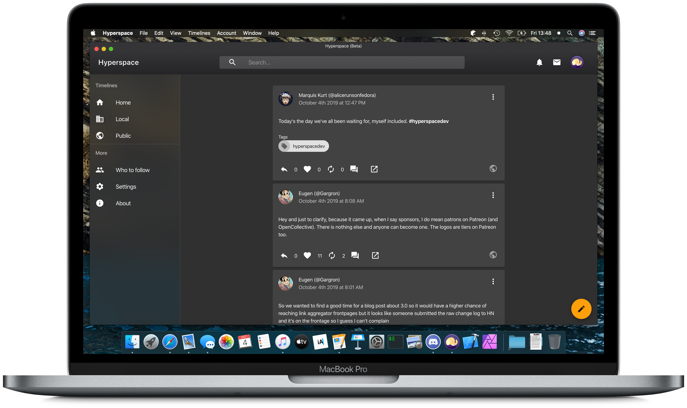

# Gopherdon App

A beautiful client for the Gopherdon network, built from Hyperspace



The Gopherdon apps are the official means of accessing the Gopherdon network at Goucher College. Built from [Hyperspace](https://github.com/hyperspacedev/hyperspace), it aims to provide a beautiful and easy-to-use interface for any Mastodon instance, including Gopherdon.

> Note: If you are looking for the current **stable** release of Hyperspace, please look at [hyperspace-classic](https://github.com/hyperspacedev/hyperspace-classic).

### Prerequisites

To develop Gopherdon, you'll need the following tools and packages:

* Node.js 6 or later
* (Optional) Visual Studio Code

This is a growing list and new things will be added over time.

## Build instrictions

### Prerequisites

To develop Hyperspace, you'll need the following tools and packages:

- Node.js 8 or later
- (Optional) Visual Studio Code

### Installing dependencies

First, clone the repository from GitHub:

```bash
git clone https://github.com/hyperspacedev/hyperspace
```

Then, in the app directory, run the following command to install all of the package dependencies:

```npm
npm install
```

### Testing changes

Before testing Hyperspace, make the following change in `config.json`, located in the public directory:

```json
    "location": "https://localhost:3000"
```

This is necessary to test Hyperspace locally and will need to be reverted after testing or before releasing to `master`.

To run a development version of Hyperspace, either run the `start` task from VS Code or run the following in the terminal:

```npm
npm start
```

The site will be hosted at `https://localhost:3000`, where you can sign in and test Hyperspace using your Mastodon account. If you have signed in before, you will be automatically logged in.

### Building a release

To build a release, run the following command:

```npm
npm build
```

The built files will be available under `build` as static files. These files should get hosted to a web server.

## Contribute

Contrubition guidelines are available in the [contributing file](.github/contributing.md) and when you make an issue/pull request. Additionally, you can access our [Code of Conduct](.github/code_of_conduct.md).

If you want to aid the project in other ways, consider supporting the project on [Patreon](https://patreon.com/marquiskurt).

If you have Matrix, you can join the Hyperspace community ([+hyperspace-masto:matrix.org](https://matrix.to/#/+hyperspace-masto:matrix.org)).
